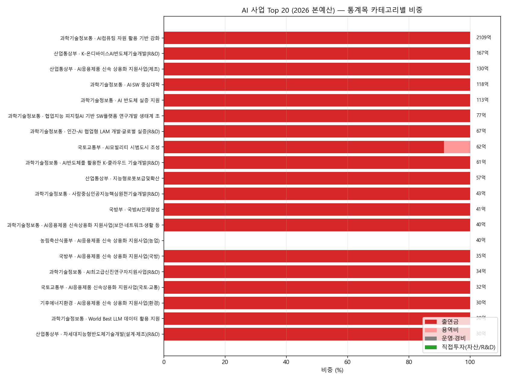
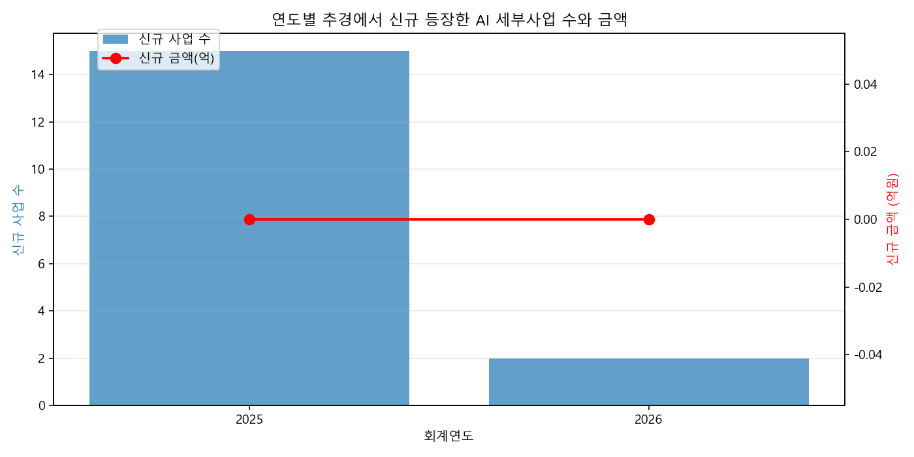
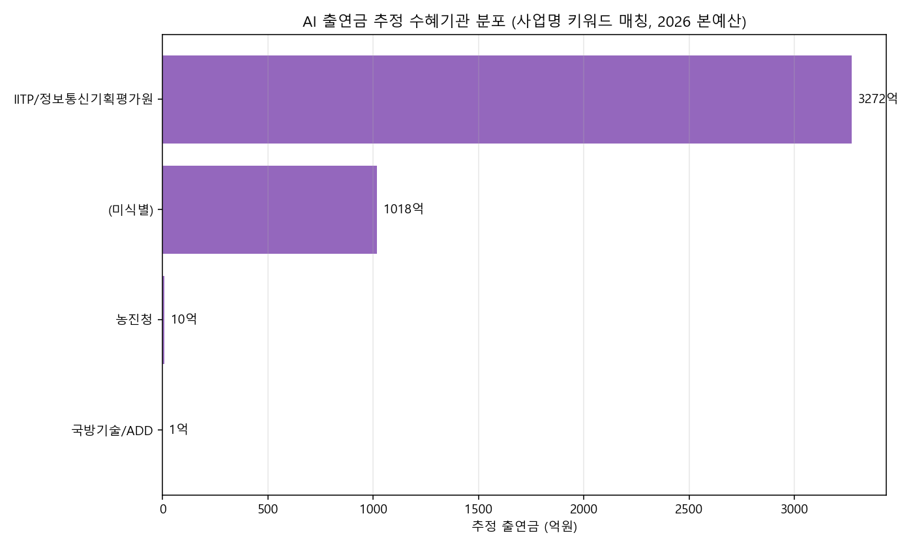
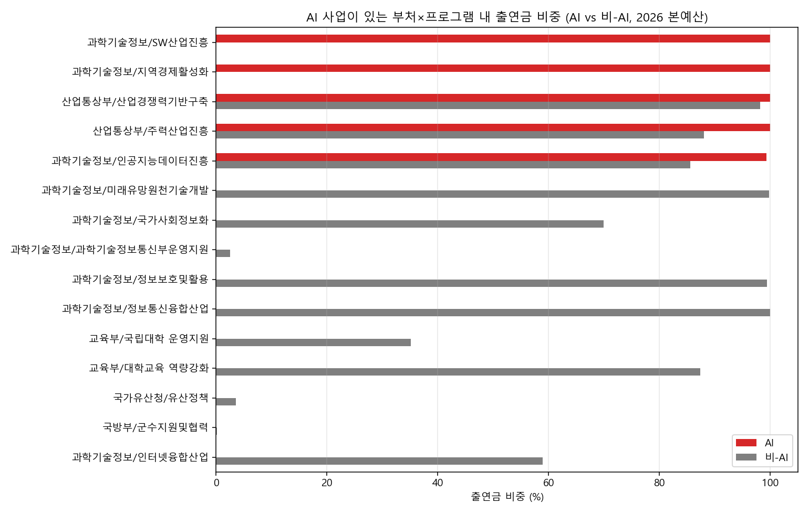

# AI 명목 예산의 누수 패턴 — 종합 분석 리포트

> 분석일: 2026-04-27 · 데이터: 열린재정 OPEN API (2020~2026 본예산+추경)

## 한 줄 결론

**2026년 정부 AI 예산 4,640억의 95.5%가 출연금 형태로 외부 위탁되며, 직접투자(자산취득·자체연구개발) 비중은 0.0%다.**

## D. Top 20 AI 사업 직접투자 0% 검증

- Top 20 합계: **3314억** (전체 AI 예산의 71.4%)
- **직접투자 0.0%인 사업: 20/20**
- 출연금 50% 이상인 사업: 19/20



## E. 추경에 끼는 AI 사업 패턴

- 2026 1차 추경에 신규 등장 AI 사업: **2건**, 합계 0.0억

|   FSCL_YY |   new_ai_sactv |   new_amt_eok |
|----------:|---------------:|--------------:|
|      2025 |             15 |             0 |
|      2026 |              2 |             0 |



## A. 출연 수혜 기관 추적 (heuristic)

완전한 수혜기관 매핑은 KODAS 국고보조금통합관리시스템 데이터 필요. 여기서는 사업명 키워드로 식별 가능한 부분만 표기:

| 추정 기관 | 추정 출연금(억) |
|---|---:|
| IITP/정보통신기획평가원 | 3272 |
| (미식별) | 1018 |
| 농진청 | 10 |
| 국방기술/ADD | 1 |



## B. 동일 부처×프로그램 내 AI vs 비-AI 비교

AI 사업이 있는 부처×프로그램 단위에서 AI 라벨과 비-AI 라벨의 출연금 비중을 비교.



## C. 재출연 단계 추적 (데이터 한계)

```

열린재정 OPEN API의 ExpenditureBudgetAdd 시리즈는 정부 → 1차 수혜자(출연기관/지자체/민간)까지의 편성정보만 포함.
재출연(출연기관 → 재단/개별과제 → 연구자) 단계는 다음 데이터에서만 식별 가능:
  · 국고보조금통합관리시스템 (KODAS, 신청 후 접근)
  · 출연기관 자체 결산서 (예: IITP, NIA, ETRI 사업단별 결산)
  · NTIS 국가R&D사업 통합정보 (별도 시스템)

근사 분석으로 가능한 것:
  - 출연금이 다시 '민간이전'/'민간경상보조' 라인으로 등장하는 단위사업 식별
  - 같은 단위사업 내에서 출연금 + 민간이전이 동시에 있는 경우 = 다중 위탁 의심

```

### 다중 위탁 의심 단위사업 (출연금 + 민간이전 동시)

| OFFC_NM            | PGM_NM             | ACTV_NM            |   chooyeon_eok |   minkan_eok |
|:-------------------|:-------------------|:-------------------|---------------:|-------------:|
| 과학기술정보통신부 | 인공지능데이터진흥 | AI경쟁력강화(일반) |         2178.9 |          1.2 |
| 교육부             | 대학교육 역량강화  | 대학미래역량 강화  |            2.5 |          6.4 |

## 데이터 출처

- `data/warehouse.duckdb` (테이블 `expenditure_item`, 611,027행)
- 열린재정 OPEN API: ExpenditureBudgetAdd7/8 (2020~2026)
- 분석 스크립트: `scripts/deep_ai_analysis.py`