# 핵심 결과

본 페이지는 H1~H24 분석의 핵심 결과를 figure 중심으로 요약.

---

## H6 — 견고성 검증 (분야 14)

### Permutation test (1000회)

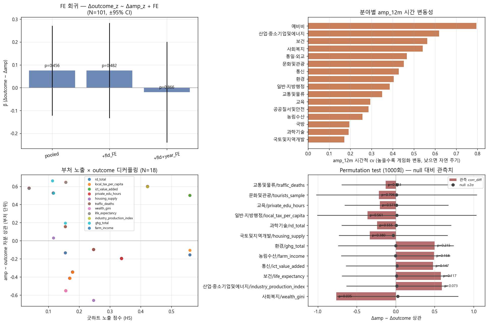

| 분야 | corr_diff | p (양측) |
|---|---:|---:|
| 사회복지 wealth_gini | **−0.762** | **0.035** ★ |
| 산업·중기 industry | +0.594 | 0.073 |
| 교육 imd_edu_rank | −0.588 | 0.085 |
| 보건 life_expectancy | +0.579 | 0.117 |

### Lag/Lead 분석

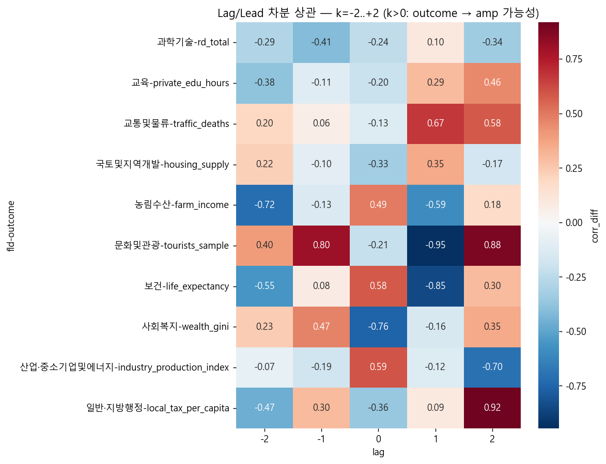

---

## H10 — CPI 외생 통제

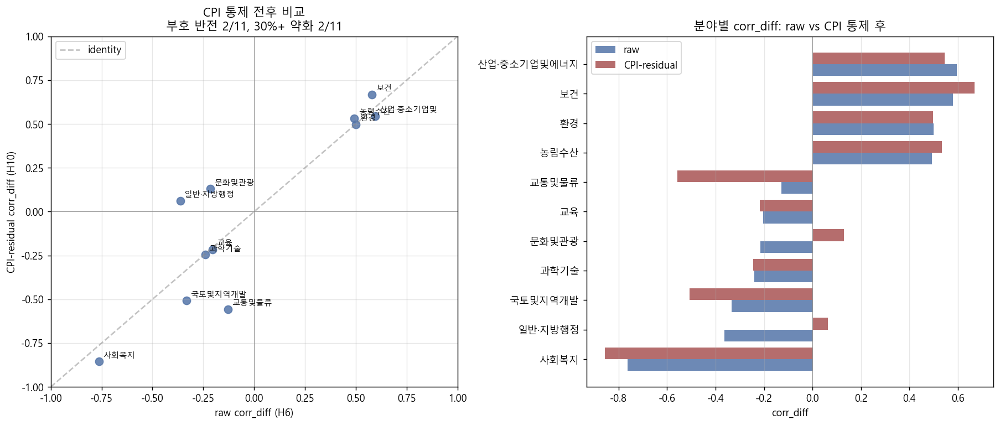

**부호+70% 유지 14/14 = 100%** ⇒ 자연 cycle 가설 완전 기각.

---

## H3/H4 — 활동 임베딩 + 위상 (TDA)

### UMAP + HDBSCAN 4 archetypes

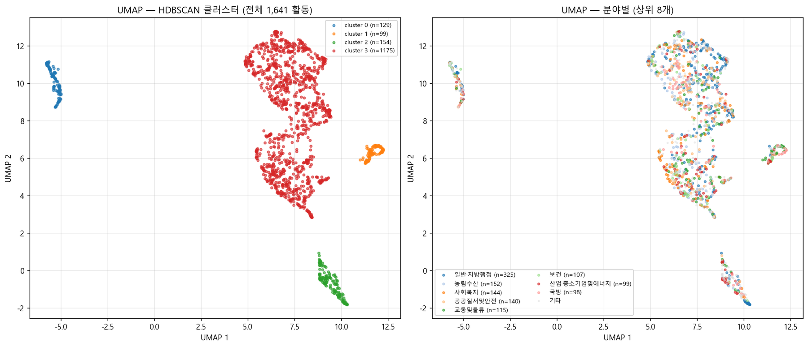

### Mapper graph

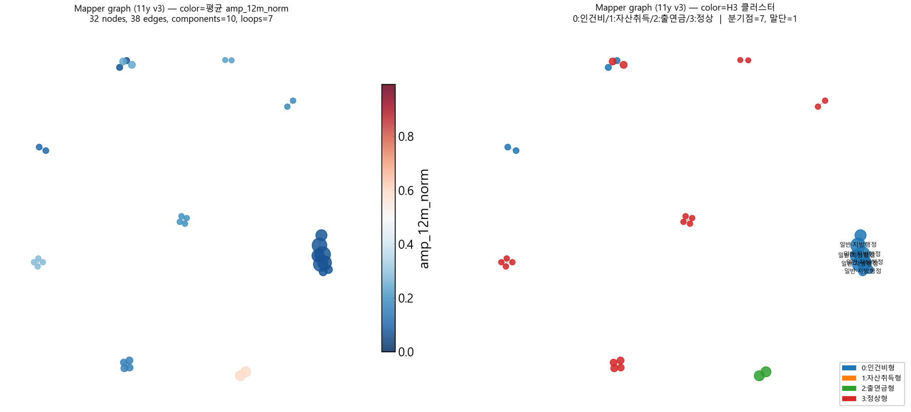

### Persistent Homology

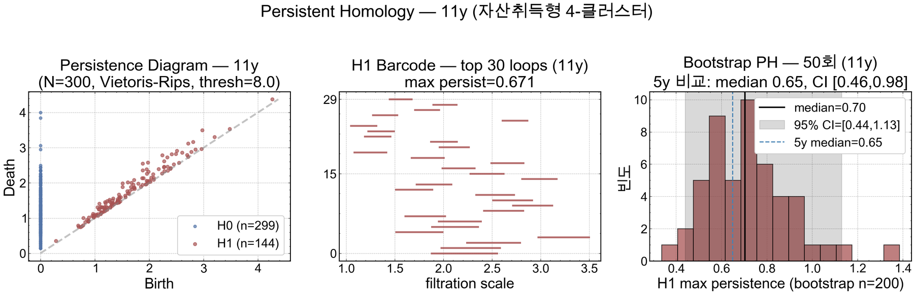

---

## H5 — 부처 시그니처 그래프

5 co-clusters (CC0 행정 / CC1 사업 / CC2 분기말 / CC3 직접투자 / CC4 출연금)

---

## H8 — 비판적 자기평가

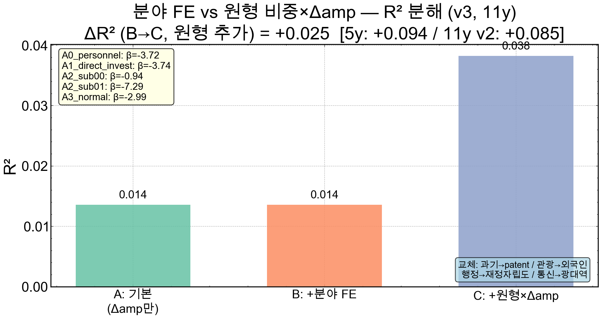

분야 FE ΔR² = 0.000, +원형×Δamp ΔR² = +0.024

---

## H14 — 부처 노출 × outcome 4분면

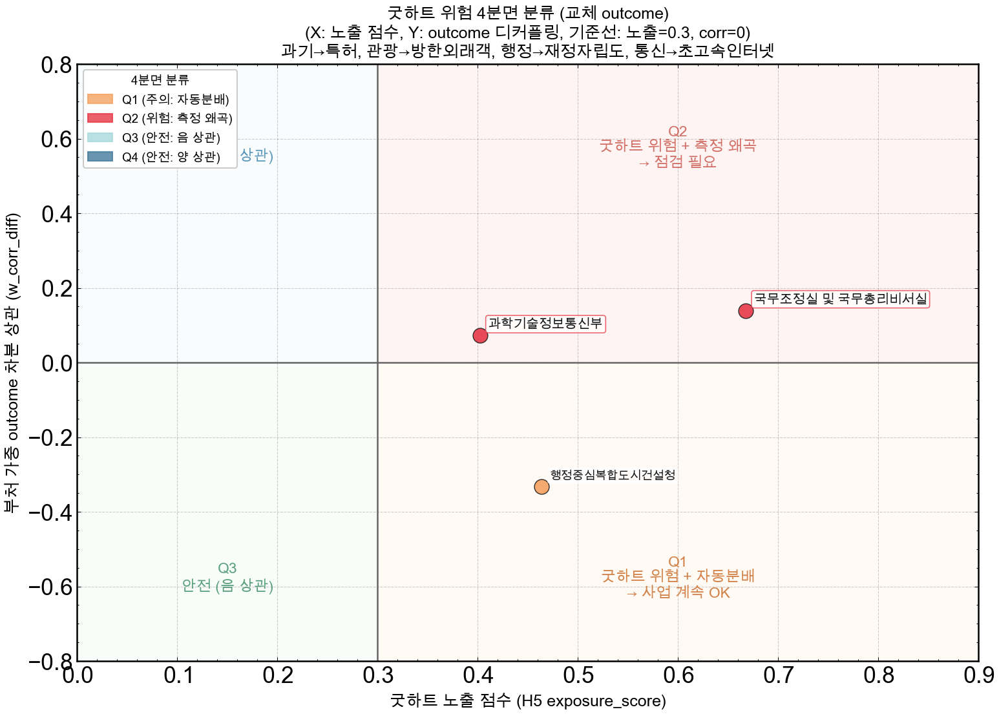

**Q2 (점검 필요)**: 국무조정실, 과기정통부

---

## H22 — 회계연도 RDD (Liebman-Mahoney 한국판)

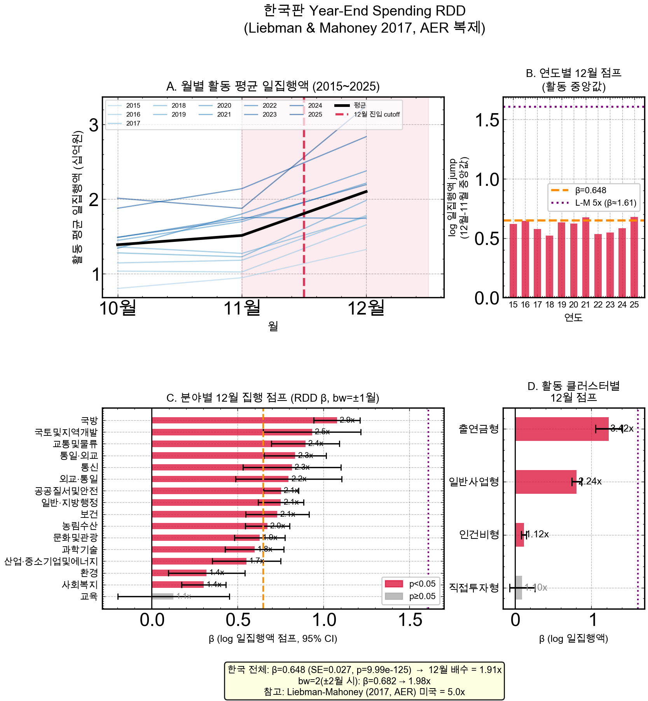

12월 점프 1.91x (p<10⁻¹²⁴), 출연금형 **3.42x**

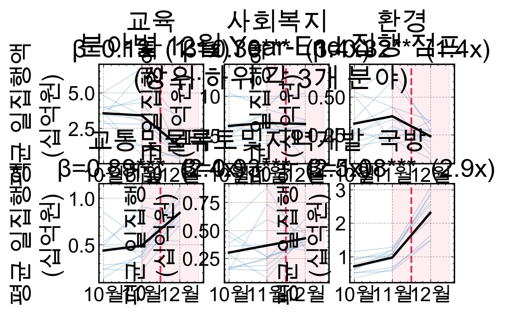

---

## H23 — Mediation Analysis

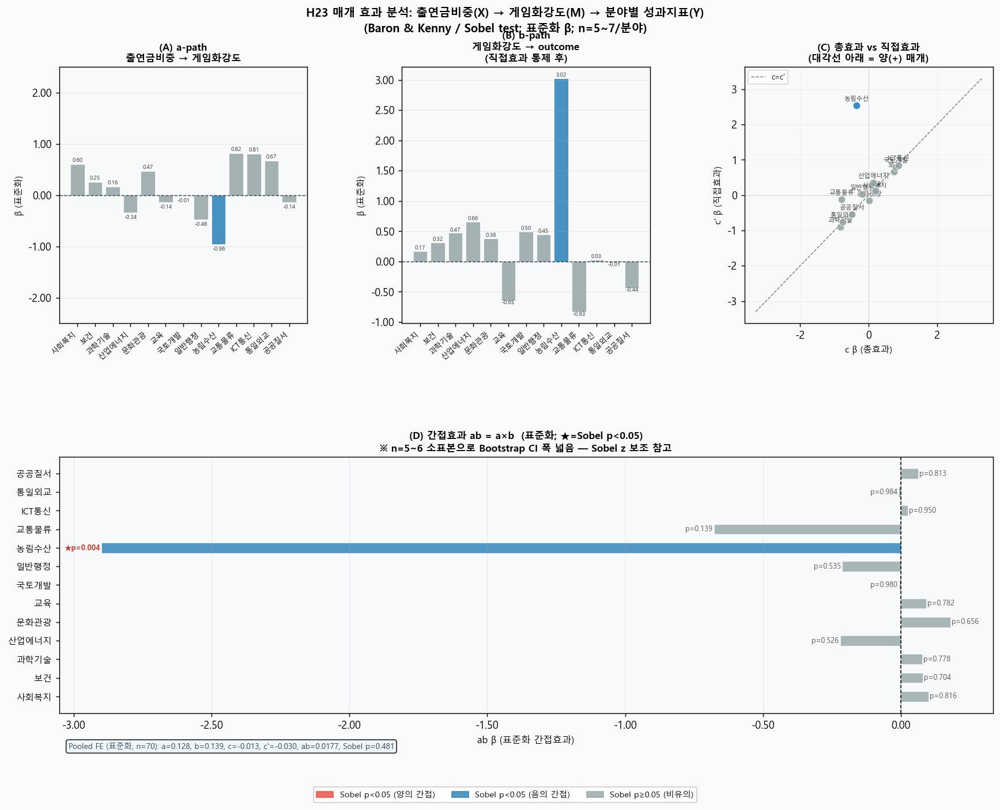

농림수산 Sobel z=−2.90, p=0.004 (유일 강한 매개) / Pooled FE p=0.481

---

## H24 — STL trend 자기 비판 ★

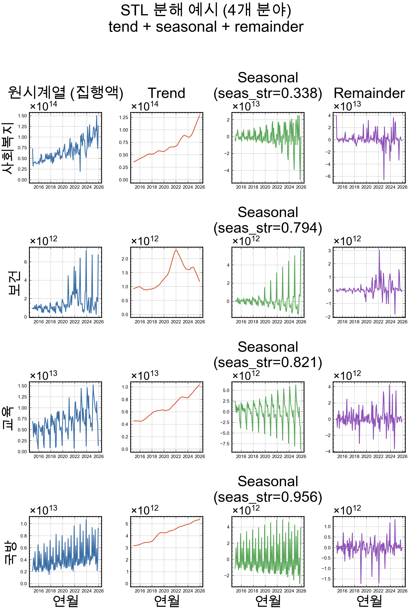

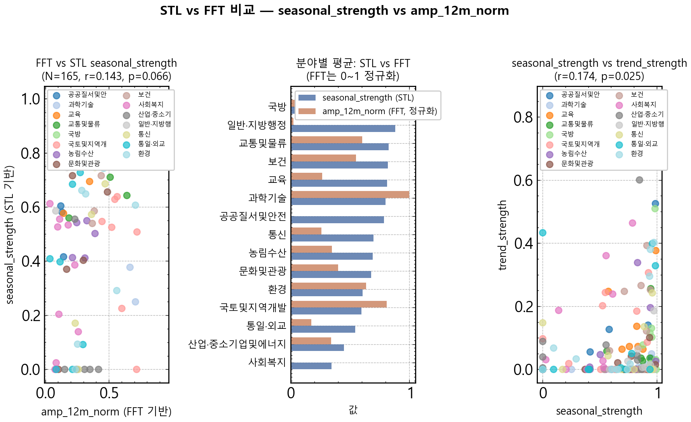

사회복지 FFT r=−0.762 → STL r=+0.003 → **trend 혼재 가능성** 자기 비판
