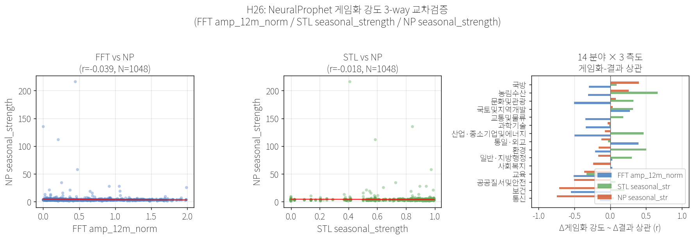
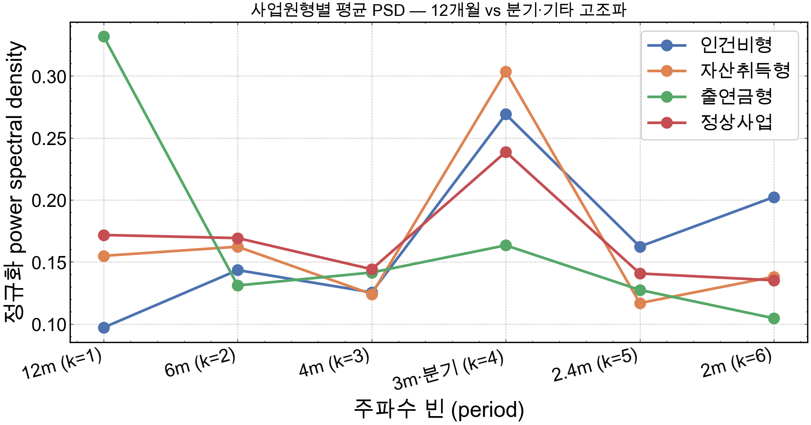
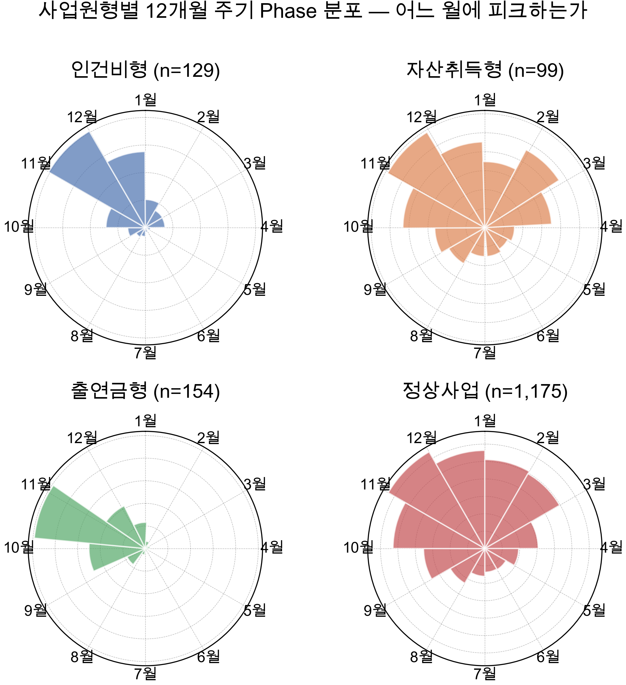
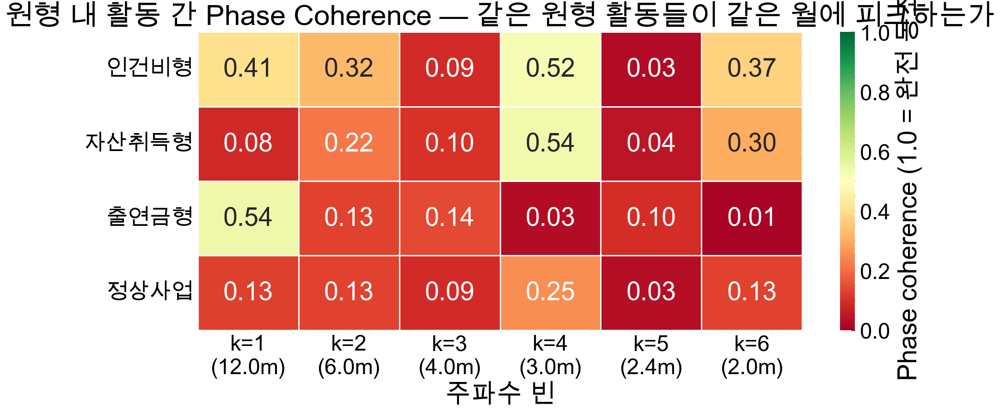
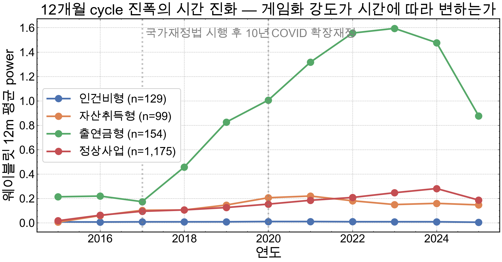
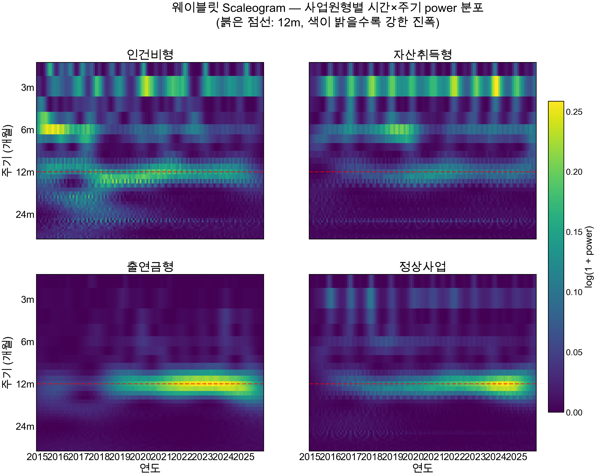

# 핵심 결과

본 페이지는 H1~H28 분석의 핵심 결과를 figure 중심으로 요약.

---

## H6 — 견고성 검증 (분야 14)

### Permutation test (1000회)

| 분야 | corr_diff | p (양측) |
|---|---:|---:|
| 사회복지 wealth_gini | **−0.762** | **0.035** ★ |
| 산업·중기 industry | +0.594 | 0.073 |
| 교육 imd_edu_rank | −0.588 | 0.085 |
| 보건 life_expectancy | +0.579 | 0.117 |

### Lag/Lead 분석

---

## H10 — CPI 외생 통제

**부호+70% 유지 14/14 = 100%** ⇒ 자연 cycle 가설 완전 기각.

---

## H3/H4 — 활동 임베딩 + 위상 (TDA)

### UMAP + HDBSCAN 4 archetypes

### Mapper graph

### Persistent Homology

---

## H5 — 부처 시그니처 그래프

5 co-clusters (CC0 행정 / CC1 사업 / CC2 분기말 / CC3 직접투자 / CC4 출연금)

---

## H8 — 비판적 자기평가

분야 FE ΔR² = 0.000, +원형×Δamp ΔR² = +0.024

---

## H14 — 부처 노출 × outcome 4분면

**Q2 (점검 필요)**: 국무조정실, 과기정통부

---

## H22 — 회계연도 RDD (Liebman-Mahoney 한국판)

12월 점프 1.91x (p<10⁻¹²⁴), **자산취득형 3.42x** ★ (이전 표기 "출연금형 3.42x"는 오기 정정 — 출연금형은 H27/H28 사이클 우세 archetype)

---

## H23 — Mediation Analysis

농림수산 Sobel z=−2.90, p=0.004 (유일 강한 매개) / Pooled FE p=0.481

---

## H24 — STL trend 자기 비판 ★

사회복지 FFT r=−0.762 → STL r=+0.003 → **trend 혼재 가능성** 자기 비판

---

## H26 — NeuralProphet 신경망 분해 (방법론 트라이앵귤레이션 셋째 축)

신경망 시계열 분해(trend / seasonality / residual)로 FFT·STL과 cross-check. 14분야 outcome 상관 재산출.

- CSV: `data/results/H26_field_outcome_corr_np.csv`, `H26_neuralprophet_summary.csv`
- 인터랙티브: [neuralprophet_components.html](interactive/neuralprophet_components.html)

---

## H27 — PSD · Phase · Coherence (출연금형 cycle 동기화) ★

| archetype | 평균 PSD | 12개월 phase coherence |
|---|---:|---:|
| **출연금형** | **0.332** ★ | **0.54** ★ |

출연금형 평균 PSD가 4 archetype 중 최대, 12개월 phase coherence 0.54로 사업 간 cycle *동기화* 입증 — Career Concerns 동적 게임 *Nash convergence* 실증.

- CSV: `H27_psd_archetype_avg.csv`, `H27_phase_distribution.csv`, `H27_coherence_intra_archetype.csv`

---

## H28 — Wavelet (CWT) 시간 동적 강화 ★

FFT의 *정상성* 가정 보완. 출연금형 12개월 cycle 진폭 시간 따라 *강화*:

| 구간 | 출연금형 진폭 | 인건비형 (통제) |
|---|---:|---:|
| 2015~17 | (baseline) | (baseline) |
| 2023~25 | **+554%** ★ | 변화 없음 |

정책적으로 *최근 3년 자료에 가중 점검* 권고.

- CSV: `data/results/H28_wavelet_12m_evolution.csv`
